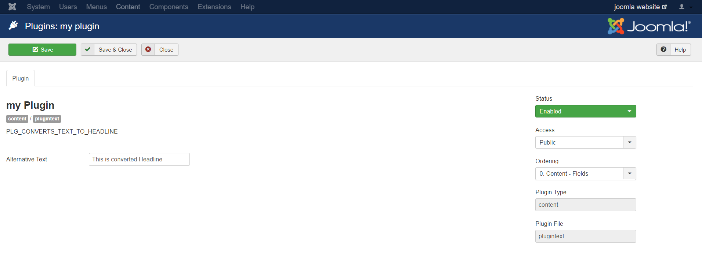
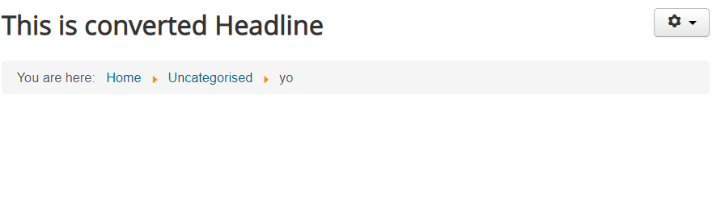

# Joomla_plugin
Joomla Plugin adds the user input to headline

## How to install it?
Clone the repository into your Local Machine

Install the Plugin

Acivate and save the Plugin and give the User Input.
-----

And you can see the Output into the article
---

